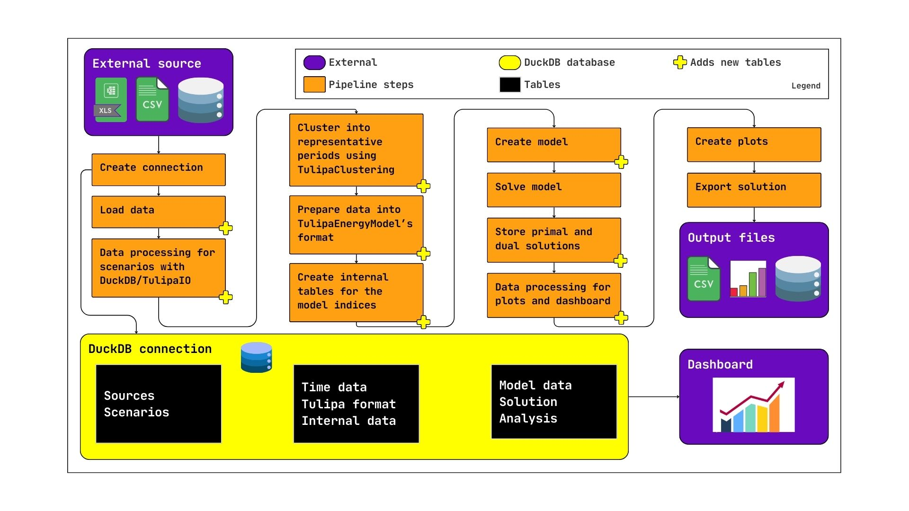

# OBZ case study

Tutorial for the OBZ case study as an example of the full workflow of Tulipa.

!!! warning "Not tested for multi-year"
    Although we use years in the tutorial below, we haven't tried it on a
    multi-year case study. Your experience may vary.

We are basing ourselves on the Tulipa [data pipeline/workflow](#TODO).
To help us navigate this workflow, we'll reproduce the diagram from the link above here.
For more details on the steps of the workflow, check the original link, or follow the tutorial.



## External source

We begin by inspecting our external data source.
This data is specific to OBZ, but it might be useful.

TODO: Expand this exploration.

```@example obz
user_input_dir = joinpath(@__DIR__, "..", "..", "user-input-files")
readdir(user_input_dir)
```

For the Tulipa workflow, we will need to transform some of this data into a specific format.
This can be done externally in whatever tools you are already comfortable with,
or through Julia via DuckDB and Tulipa's convenience functions.

## Create connection

Once we are done manipulating the data externally, it is time to create a DuckDB connection.

You can create a connection storing the DB locally, or keep everything in-memory only.
Let's assume you want to store the DB, otherwise you can just remove this argument.

```@example obz
using DuckDB: DBInterface, DuckDB

connection = DBInterface.connect(DuckDB.DB, "obz.db")
# Manually cleaning everything
for row in DuckDB.query(connection, "SHOW TABLES")
    try
        DuckDB.query(connection, "DROP TABLE $(row.name)")
    catch
        DuckDB.query(connection, "DROP VIEW $(row.name)")
    end
end
```

We will be performing various queries with DuckDB. To format them nicely, we can wrap the results in a `DataFrame`:

```@example obz
using DataFrames: DataFrame

nice_query(str) = DataFrame(DuckDB.query(connection, str))
```

## Load data

Once we are done manipulating the data externally, it is time to load it into the DuckDB connection.
We can load them manually with `DuckDB`, but we also have a convenience function:

```@example obz
using TulipaIO: TulipaIO

TulipaIO.read_csv_folder(
    connection, 
    user_input_dir,
    replace_if_exists = true,
    skip = 1, # Data in this folder has an extra header line
)
TulipaIO.read_csv_folder(
    connection, 
    joinpath(user_input_dir, "profiles"), 
    replace_if_exists = true,
)

nice_query("SHOW TABLES")
```

## Data processing for scenarios with DuckDB/TulipaIO

As we mentioned before, you can process your data externally and then load it.
But you can also use Julia and DuckDB to process the data.

This step is required to prepare the data for TulipaClustering for the
clustering of the profile data.

We need a single profiles table with 4 columns:

- `profile_name`
- `year`
- `timestep`
- `value`

And we have 2 profiles tables:

```@example obz
nice_query("FROM profiles LIMIT 10")
```

```@example obz
nice_query("FROM min_max_reservoir_levels LIMIT 10")
```

Notice that these are all hourly profiles for the whole year:

```@example obz
nice_query("SELECT year, MAX(timestep) FROM profiles GROUP BY year")
```

```@example obz
nice_query("SELECT year, MAX(timestep) FROM min_max_reservoir_levels GROUP BY year")
```

So we will transform both these tables to long format and stack them:

```@example obz
using TulipaClustering: TulipaClustering 

TulipaClustering.transform_wide_to_long!(connection, "profiles", "pivot_profiles")
TulipaClustering.transform_wide_to_long!(connection, "min_max_reservoir_levels", "pivot_min_max_reservoir_levels")

DuckDB.query(connection, "CREATE SCHEMA IF NOT EXISTS input")
DuckDB.query(
    connection,
    "CREATE OR REPLACE TABLE input.profiles AS
    FROM pivot_profiles
    UNION
    FROM pivot_min_max_reservoir_levels
    ORDER BY profile_name, year, timestep
    "
)

nice_query("SELECT COUNT(*) FROM input.profiles")
```

The expected number of rows is

```@example obz
8760 * (165 - 2 + 14 - 2)
```

We can get some specific profile the following way:

```@example obz
using Plots

profile_name = "NL_Solar"
year = 2050

# Notice that we don't use DataFrame, because we don't need the conversion, and
# it's cheaper to not do it.
subtable = DuckDB.query(
    connection, 
    "SELECT timestep, value FROM input.profiles 
    WHERE profile_name='$profile_name' AND year=$year
    ORDER BY timestep
    ",
)
df = DataFrame(subtable)
plot(df.timestep, df.value, lab=profile_name)
```

## Cluster into representative periods using TulipaClustering

```@example obz
using Distances: SqEuclidean
using Random: Random

  ## Data for clustering
clustering_params = (
    n_rp = 3,                         # number of representative periods
    period_duration = div(8760, 365), # hours of the representative period
    method = :k_means,
    distance = SqEuclidean(),
    ## Data for weight fitting
    weight_type = :convex,
    tol = 1e-2,
    ## Data for projected subgradient
    niters = 100,
    learning_rate = 0.001,
    adaptive_grad = false,
)

Random.seed!(123)
TulipaClustering.cluster!(
    connection,
    clustering_params.period_duration,
    clustering_params.n_rp;
    clustering_params.method,
    clustering_params.distance,
    clustering_params.weight_type,
    clustering_params.tol,
    clustering_params.niters,
    clustering_params.learning_rate,
    clustering_params.adaptive_grad,
)
```

These are the tables created by TulipaClustering:

```@example obz
nice_query("SELECT table_name FROM duckdb_tables WHERE table_name LIKE 'cluster.%'")
```

## Prepare data for TulipaEnergyModel's format

Now the hard part starts. We need to create several files for Tulipa using our files.
Again, we remind you that you can create most of these files externally, i.e.,
you don't have to use DuckDB to join them here.

### Year data

This data is already correct in the case study and contains a single year.

```@example obz
DuckDB.query(
    connection,
    "CREATE TABLE input.year_data AS 
    FROM year_data
    ORDER BY year
    ",
)
```

### Assets

First, let's join all basic assets data. I will use code to generate the list
of relevant tables, but you can do it manually too.

!!! tip "TODO"
    There is opportunity to create a convenience function here.

```@example obz
table_names = [
    row.table_name
    for row in DuckDB.query(connection, "FROM duckdb_tables WHERE table_name LIKE 'assets_%_basic_data'")
]

query_string = join(
    ["FROM $t" for t in table_names],
    " UNION BY NAME ",
)
DuckDB.query(
    connection, 
    "CREATE TABLE input.asset AS 
    SELECT
        name AS asset,
        type,
        COALESCE(capacity, 0) AS capacity,
        COALESCE(capacity_storage_energy, 0) AS capacity_storage_energy,
        COALESCE(is_seasonal, false) AS is_seasonal,
    FROM ($query_string)
    ORDER BY asset
    ",
)

nice_query("FROM input.asset ORDER BY random() LIMIT 10")
```

Similarly, we join the `assets_%_yearly_data` tables:

```@example obz
table_names = [
    row.table_name
    for row in DuckDB.query(connection, "FROM duckdb_tables WHERE table_name LIKE 'assets_%_yearly_data'")
]

query_string = join(
    ["FROM $t" for t in table_names],
    " UNION BY NAME ",
)

DuckDB.query(
    connection, 
    "CREATE TABLE t_asset_yearly AS 
    FROM ($query_string)
    ",
)

nice_query("FROM t_asset_yearly ORDER BY random() LIMIT 10")
```

This `t_asset_yearly` tables is used to create three other asset tables.

```@example obz
DuckDB.query(
    connection,
    "CREATE TABLE input.asset_commission AS 
    SELECT
        name AS asset,
        year AS commission_year,
    FROM t_asset_yearly
    ORDER by asset
    "
)

DuckDB.query(
    connection,
    "CREATE TABLE input.asset_milestone AS 
    SELECT
        name AS asset,
        year AS milestone_year,
        coalesce(0, peak_demand) AS peak_demand,
        coalesce(0, initial_storage_level) AS initial_storage_level,
        coalesce(0, storage_inflows) AS storage_inflows,
    FROM t_asset_yearly
    ORDER by asset
    "
)

DuckDB.query(
    connection,
    "CREATE TABLE input.asset_both AS 
    SELECT
        name AS asset,
        year AS milestone_year,
        year AS commission_year,
        coalesce(0, initial_units) AS initial_units,
        coalesce(0, initial_storage_units) AS initial_storage_units,
    FROM t_asset_yearly
    ORDER by asset
    "
)
```

### Flows

We repeat the steps above for flows:

```@example obz
table_names = [
    row.table_name
    for row in DuckDB.query(connection, "FROM duckdb_tables WHERE table_name LIKE 'flows_%_basic_data'")
]
query_string = join(
    ["FROM $t" for t in table_names],
    " UNION BY NAME ",
)
DuckDB.query(
    connection, 
    "CREATE TABLE input.flow AS 
    SELECT
        from_asset,
        to_asset,
        carrier,
        COALESCE(capacity, 0) AS capacity,
        COALESCE(is_transport, false) AS is_transport,
    FROM ($query_string)
    ORDER BY from_asset, to_asset
    ",
)

table_names = [
    row.table_name
    for row in DuckDB.query(connection, "FROM duckdb_tables WHERE table_name LIKE 'flows_%_yearly_data'")
]

query_string = join(
    ["FROM $t" for t in table_names],
    " UNION BY NAME ",
)

DuckDB.query(
    connection, 
    "CREATE TABLE t_flow_yearly AS 
    FROM ($query_string)
    ",
)

DuckDB.query(
    connection,
    "CREATE TABLE input.flow_commission AS 
    SELECT
        from_asset,
        to_asset,
        year AS commission_year,
        coalesce(1, efficiency) AS efficiency,
    FROM t_flow_yearly
    ORDER by from_asset, to_asset
    "
)

DuckDB.query(
    connection,
    "CREATE TABLE input.flow_milestone AS 
    SELECT
        from_asset, 
        to_asset,
        year AS milestone_year,
        coalesce(0, variable_cost) AS variable_cost,
    FROM t_flow_yearly
    ORDER by from_asset, to_asset
    "
)

DuckDB.query(
    connection,
    "CREATE TABLE input.flow_both AS 
    SELECT
        from_asset, 
        to_asset,
        year AS milestone_year,
        year AS commission_year,
        coalesce(0, initial_export_units) AS initial_export_units,
        coalesce(0, initial_import_units) AS initial_import_units,
    FROM t_flow_yearly
    ORDER by from_asset, to_asset
    "
)
```

### Assets profiles

We join the assets and storage files.

```@example obz
DuckDB.query(
    connection, 
    "CREATE TABLE input.assets_profiles AS 
    FROM assets_profiles
    UNION BY NAME
    FROM assets_storage_min_max_reservoir_level_profiles
    ORDER BY asset, commission_year, profile_name
    ",
)
```

```@example obz
DuckDB.query(
    connection, 
    "CREATE TABLE input.assets_timeframe_profiles AS 
    FROM assets_storage_min_max_reservoir_level_profiles
    ORDER BY asset, commission_year, profile_name
    ",
)
```

### Partitions

```@example obz
DuckDB.query(
    connection,
    "CREATE TABLE input.assets_rep_periods_partitions AS
    SELECT
        t.name AS asset,
        t.year,
        (t.partition)::string AS partition,
        rep_periods_data.rep_period,
        'uniform' AS specification,
    FROM t_asset_yearly AS t
    LEFT JOIN cluster.rep_periods_data AS rep_periods_data
        ON t.year = rep_periods_data.year
    ORDER BY asset, t.year, rep_period
    ",
)

DuckDB.query(
    connection,
    "CREATE TABLE input.flows_rep_periods_partitions AS
    SELECT
        input.flow.from_asset,
        input.flow.to_asset,
        t_from.year,
        t_from.rep_period,
        'uniform' AS specification,
        IF(
            input.flow.is_transport,
            greatest(t_from.partition, t_to.partition),
            least(t_from.partition, t_to.partition)
        ) AS partition,
    FROM input.flow
    LEFT JOIN input.assets_rep_periods_partitions AS t_from
        ON input.flow.from_asset = t_from.asset
    LEFT JOIN input.assets_rep_periods_partitions AS t_to
        ON input.flow.to_asset = t_to.asset
        AND t_from.year = t_to.year
        AND t_from.rep_period = t_to.rep_period
    ",
)


DuckDB.query(
    connection,
    "CREATE TABLE input.assets_timeframe_partitions AS
    SELECT
        input.asset.asset,
        input.year_data.year,
        '1' AS partition,
        'uniform' AS specification,
    FROM input.asset
    CROSS JOIN input.year_data
    WHERE input.asset.is_seasonal
    ORDER BY asset, year
    ",
)
```

### Timeframe

The `timeframe` profiles are computed with the aggregation over `period`.

```@example obz
DuckDB.query(
    connection,
    "
    CREATE TABLE input.profiles_timeframe AS
    WITH t_timeframe_profile_names AS (
        SELECT DISTINCT profile_name FROM pivot_min_max_reservoir_levels  
    )
    SELECT 
        t_timeframe_profile_names.profile_name,
        cluster.profiles_rep_periods.year,
        cluster.rep_periods_mapping.period,
        AVG(cluster.profiles_rep_periods.value) AS value,
    FROM t_timeframe_profile_names
    LEFT JOIN cluster.profiles_rep_periods
        ON t_timeframe_profile_names.profile_name = cluster.profiles_rep_periods.profile_name
    LEFT JOIN cluster.rep_periods_mapping
        ON cluster.profiles_rep_periods.year = cluster.rep_periods_mapping.year
        AND cluster.profiles_rep_periods.rep_period = cluster.rep_periods_mapping.rep_period
    GROUP BY 
        t_timeframe_profile_names.profile_name,
        cluster.profiles_rep_periods.year,
        cluster.rep_periods_mapping.period
    ORDER BY
        t_timeframe_profile_names.profile_name,
        cluster.profiles_rep_periods.year,
        cluster.rep_periods_mapping.period
    ",
)
```

### Populate with defaults

Finally, in many cases, you will need to complete the missing columns with additional information.
To simplify this process, we created the `populate_with_defaults!` function.
Please read TulipaEnergyModel's [populate with default section](#TODO) for a complete picture.

```@example obz
using TulipaEnergyModel: TulipaEnergyModel as TEM

TEM.populate_with_defaults!(connection)
```

## Create internal tables for the model indices

```@example obz
energy_problem = TEM.EnergyProblem(connection)
```

Now we have any more tables, however the `model` itself was not created yet.

```@example obz
nice_query(
    "SELECT DISTINCT
        regexp_extract(table_name, '^[a-z]*_', 0) as prefix,
        COUNT(*) AS count,
    FROM duckdb_tables()
    WHERE prefix IS NOT NULL
    GROUP BY prefix
    ORDER BY prefix
    ",
)
```

## Create model

```@example obz
TEM.create_model!(energy_problem)
```

## Solve model

Last, but not least important, we solve the model:

```@example obz
TEM.solve_model!(energy_problem)
```

## Store primal and dual solution

## Data processing for plots and dashboard

## Create plots

## Export solution

## Debug

```@example obz
# DEBUG
#=
expected_folder = joinpath(@__DIR__, "..", "..", "tulipa-energy-model-files") 
TulipaIO.read_csv_folder(
    connection, 
    expected_folder;
    schemas = TEM.sql_input_schema_per_table_name,
    table_name_prefix = "expected_",
)
nice_query("FROM expected_assets_profiles ORDER BY asset LIMIT 10")

# Copy remaining tables
copied_over = String[]

for row in DuckDB.query(connection, "FROM duckdb_tables WHERE table_name LIKE 'expected_%'")
    expected_table_name = row.table_name
    table_name = replace(expected_table_name, "expected_" => "")
    if table_name in (
        "rep_periods_data",
        "rep_periods_mapping",
        "timeframe_data",
        "profiles_rep_periods",
    )
        continue
    end
    input.table_name = "input." * table_name
    exitflag = DuckDB.query(
        connection, 
        "CREATE TABLE IF NOT EXISTS $input.table_name AS FROM $expected_table_name",
    )
    if length(collect(exitflag)) > 0
        push!(copied_over, table_name)
    end
end
copied_over
=# 
"Does not work anymore"
```

### Differences between expected and computed data

```@example obz
#=
for (table_name, primary_keys) in (
    ("input.asset", (:asset,)),
    ("input.asset_both", (:asset, :milestone_year, :commission_year)),
    ("input.asset_commission", (:asset, :commission_year)),
    ("input.asset_milestone", (:asset, :milestone_year)),
    ("input.assets_profiles", (:asset, :commission_year, :profile_type)),
    ("input.assets_rep_periods_partitions", (:asset, :year, :rep_period)),
    ("input.assets_timeframe_partitions", (:asset, :year)),
    ("input.assets_timeframe_profiles", (:asset, :commission_year, :profile_type)),
    ("input.flow", (:from_asset, :to_asset)),
    ("input.flow_both", (:from_asset, :to_asset, :milestone_year, :commission_year)),
    ("input.flow_commission", (:from_asset, :to_asset, :commission_year)),
    ("input.flow_milestone", (:from_asset, :to_asset, :milestone_year)),
    ("input.flows_profiles", (:from_asset, :to_asset, :year, :profile_type)),
    ("input.flows_rep_periods_partitions", (:from_asset, :to_asset, :year, :rep_period)),
    ("input.group_asset", (:name, :milestone_year)),
    ("cluster.profiles_rep_periods", (:profile_name, :year, :rep_period, :timestep)),
    ("input.profiles_timeframe", (:profile_name, :year, :period)),
    ("cluster.rep_periods_data", (:year, :rep_period)),
    ("cluster.rep_periods_mapping", (:year, :period, :rep_period)),
    ("cluster.timeframe_data", (:year, :period)),
    ("input.year_data", (:year,)),
)
    expected_table_name = replace(table_name, "input." => "expected_", "cluster." => "expected_")
    join_keys = join(
        ["t.$k = $expected_table_name.$k" for k in primary_keys],
        " AND ",
    )

    if (DuckDB.query(connection, "SELECT COUNT(*) == 0 FROM duckdb_tables WHERE table_name = '$expected_table_name'") |> first |> first)
        continue
    end

    t = replace(expected_table_name, "expected_" => "")
    num = DuckDB.query(
        connection,
        "CREATE TABLE diff_$t AS
        SELECT 'computed' AS origin, $table_name.*
        FROM $table_name AS t ANTI JOIN $expected_table_name ON $join_keys
        UNION BY NAME
        SELECT 'expected' AS origin, $expected_table_name.*
        FROM $expected_table_name ANTI JOIN $table_name AS t ON $join_keys
    ") |> first |> first
    if num > 0
        @show table_name num
    end
end
=#
"Does not work anymore"
```

# TODO LIST ^

```@example obz
#=
sample(t, n = 7) = nice_query("FROM $t ORDER BY random() LIMIT $n")
sample("diff_profiles_rep_periods", 15)
=#
"Does not work anymore"
```

```@example obz
nice_query("
    FROM variables.flow 
    WHERE from_asset='AT_Battery' 
        AND to_asset='AT_E_Balance' 
        AND year=2050 
        AND rep_period=1 
    ORDER BY random() 
    LIMIT 5
")
nothing
```

## [TODO](@id TODO)

- [ ] Link to Tulipa data pipeline
